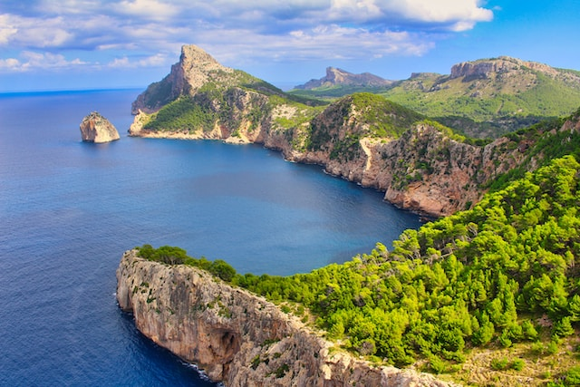

Urlaub Mallorca

* 2 Wochen - 2 Orte
 Reisehinweise Link
 Steckdosen Check: Typ C und F, 230V/50Hz -> kein Adapter

## To-Do

** Reisekrankenversicherung
** Koffer
** Spanisch lernen
** Vorfreude!

## Flüge
* Hinflug: STR -> PMI, 05. Sep. 13:37
* Rückflug: PMI -> STR, 19. Sep. 13:37

## Unterkunft

	* Hotel Palma
		* 05.09 - 12.09
		* 140€ / Nacht
	* Hotel Manacor
		* 12.09 - 19.09
		* 120€ / Nacht
		
Gesamt: 1820€

## Verkehrsmittel
## Reiseplan

 * Palma
	* Stadt erkunden
	* Catedral de MallorcaAlcudia Old Town und Cap de Formentor (Norden)
	* Serra de Tramuntana (Westen)
	* Strand
	
 * Manacor
	* Stadt erkunden
	* Fahrrad: Via Verde Manacor-Arta
	* Cuevas de Arta
	* Cala Domingos
	* Castell de Capdepera

